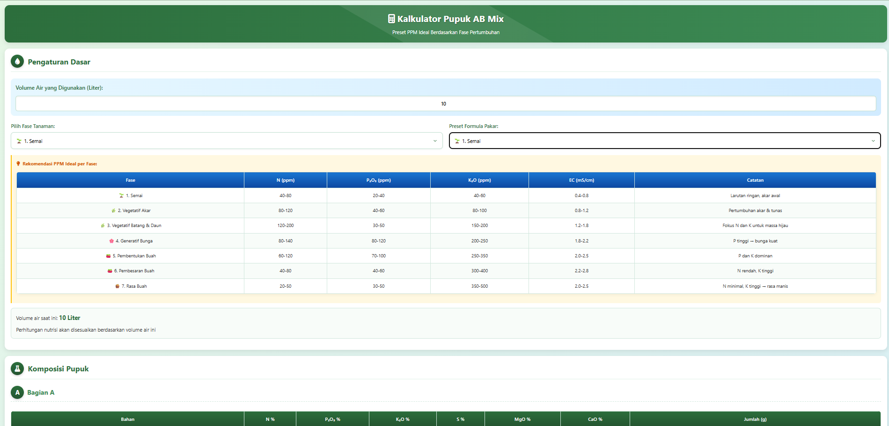

# 🌴 Sistem Rekomendasi Nutrisi Tanaman untuk Iklim Khatulistiwa

[](https://github.com/username/repo/blob/main/LICENSE)
[](https://github.com/ellerbrock/open-source-badges/)
[]()

Sistem rekomendasi nutrisi tanaman yang dirancang khusus untuk kondisi iklim khatulistiwa dengan suhu tinggi (>30°C). Proyek ini membantu petani menghindari overdosis nutrisi akibat penguapan tinggi dan stres panas.



## 🌡️ Masalah Utama: Overdosis Nutrisi Akibat Suhu Tinggi

Di iklim khatulistiwa, suhu tinggi menyebabkan masalah unik pada nutrisi tanaman:

1. **Peningkatan Penguapan**:
   - 🚿 Transpirasi tinggi menyebabkan akumulasi garam di zona perakaran
   - 📈 Konsentrasi nutrisi meningkat secara signifikan dalam waktu singkat

2. **Stres Termal pada Tanaman**:
   - 🔥 Efisiensi penyerapan nutrisi menurun pada suhu >32°C
   - ⚠️ Resiko toksisitas amonia meningkat

3. **Gejala Overdosis**:
   - 🍃 Daun kaku dan dingin (EC aman)
   - 🥵 Daun lemas dan hangat (EC terlalu tinggi)
   - 🟡 Ujung daun kuning pucat (overdosis garam)
   - 🌡️ Daun menggulung ke atas (stres panas akut)

## 🛠️ Solusi yang Diberikan

### 1. Penyesuaian EC dan PPM Berbasis Suhu
| Fase Pertumbuhan       | EC Target (mS/cm) | Total PPM | Penyesuaian        |
|------------------------|-------------------|-----------|--------------------|
| **Awal Vegetatif**     | 0.4-0.5           | 200-250   | ▼ 60% dari standar |
| **Vegetatif Intensif** | 0.6-0.8           | 300-400   | ▼ 50% dari standar |
| **Transisi Generatif** | 0.8-1.0           | 400-500   | ▼ 55% dari standar |
| **Generatif**          | 1.0-1.2           | 500-600   | ▼ 65% dari standar |

**Formula Penyesuaian**: Setiap kenaikan 1°C di atas 32°C, turunkan EC tambahan 0.1 mS/cm

### 2. Formula Nutrisi Khatulistiwa
**Vegetatif**:
- 🟢 Nitrogen (N): 25 ppm
- 🟠 Kalium (K): 80 ppm
- 🔵 Kalsium (Ca): 60 ppm
- 🟣 Magnesium (Mg): 30 ppm

**Generatif**:
- 🟢 Nitrogen (N): 20 ppm
- 🟠 Kalium (K): 120 ppm (ditingkatkan untuk mitigasi panas)
- 🔴 Fosfor (P): 25 ppm

> ⚠️ **Peringatan**: Hindari urea/NH₄⁺ >5ppm karena risiko toksisitas amonia di suhu tinggi

### 3. Protokol Aplikasi Harian
1. **🌅 Pagi (06:00-07:00)**:
   - Beri larutan nutrisi penuh (EC sesuai fase) 
   - Volume 20% lebih banyak
   
2. **☀️ Siang (10:00-11:00)**:
   - Flushing cepat dengan air bersih (EC 0) 
   - 100-200 mL/pot
   
3. **🌇 Sore (15:00-16:00)**:
   - Beri larutan nutrisi setengah konsentrasi 
   - Tambah asam humat 0.5%

### 4. Mitigasi Panas
| Teknik             | Implementasi                        | Manfaat                     |
|--------------------|-------------------------------------|-----------------------------|
| **Komposisi Media**| Cocopeat 50%, Perlit 30%, Biochar 15% | Penahan air + penyerap garam |
| **Pendinginan Pot**| Aluminium foil + batang pisang kering | Pantulkan radiasi + insulasi |
| **Naungan**        | Paranet 40-50% (jam 11-15)          | Turunkan suhu 3-5°C         |
| **Penjadwalan**    | Siram saat suhu <30°C               | Hindari stres panas        |

## 🚑 Action Plan untuk Overdosis

### Tahap Akut (daun mengering):
1. 💧 Rendam pot dalam air bersih (30 menit)
2. 🌿 Semprot daun dengan:
   - Air kelapa 100 mL/L 
   - Asam humat 2 mL/L 
   - Silika 1 mL/L
3. ⛱️ Naungi 70% selama 48 jam

### Pemulihan (3-7 hari):
1. ⬇️ Turunkan EC ke 0.4 mS/cm
2. 🦠 Beri bakteri rhizobium
3. ⛱️ Naungi 50% selama 3 hari
4. 🔄 Tambah frekuensi flushing siang hari

## 💻 Cara Menggunakan

1. Clone repositori:
   ```bash
   git clone https://github.com/sekadau-online/abmixer.git
   ```

2. Buka file HTML di browser:
   - `abmix.html`: Kalkulator pupuk AB Mix
   - `abmix-s.html` : Kalkulator preferensi Suhu (Pengembangan)
   - `micro.html` : Kalkulator Mikro Nutrien.
   - `recomendation.html`: Rekomendasi khusus iklim khatulistiwa

**Untuk petani**:
- 🌡️ Pantau suhu harian
- 📏 Ukur EC zona akar setiap 3 hari (target 0.8-1.2 mS/cm)
- 💦 Lakukan flushing mingguan dengan volume air = 2x volume media

## 📊 Deteksi Dini Masalah Nutrisi

| Gejala                  | Kemungkinan Penyebab     | Solusi                     |
|-------------------------|--------------------------|----------------------------|
| Daun kaku + dingin      | EC aman                  | Pertahankan protokol       |
| Daun lemas + hangat     | EC terlalu tinggi        | Turunkan EC 0.2 mS/cm      |
| Ujung daun kuning       | Overdosis garam          | Flushing + turunkan EC     |
| Pertumbuhan terhambat   | Akumulasi garam          | Ganti media + flushing     |

**🔍 Tes Sederhana**: Campur sampel media dengan air destilasi (1:5), ukur EC. Jika >1.5 mS/cm, segera lakukan flushing.

## 🤝 Berkontribusi

Kontribusi terbuka untuk:
- 🌿 Menambahkan preset tanaman tropis baru
- 🧠 Memperbaiki algoritma penyesuaian suhu
- ⛅ Mengembangkan modul prediksi cuaca

## ☕ Dukung Proyek Ini

Jika proyek ini bermanfaat, Anda dapat mendukung pengembang dengan secangkir kopi:

| Cryptocurrency | Alamat Dompet                             |
|----------------|-------------------------------------------|
| **Verus**      | `RPMu8QpUxvevPuTX2baVeVmt9PvYfWjURN`      |
| **Bitcoin**    | `1F5i3twCN6rMKu6KZRbNYySgP8TwzKrWgh`      |
| **Ethereum**   | `0x1F491f5d86b78865cD20379FC47FaA04E4f5ceB3` |
| **Litecoin**   | `LZJfK7F2Sm6QahnUjZafpzWSbLqE7mp2NK`      |

## 📜 Lisensi

Proyek ini dilisensikan di bawah **[MIT License](https://github.com/username/repo/blob/main/LICENSE)**.

**Dikembangkan Oleh Muhammad Kahfi Al Fauzan** dengan ❤️ untuk petani Indonesia  
© 2023 Rekomendasi Pertanian Tropis

---

[](https://github.com/sekadau-online/abmixer)
[]()